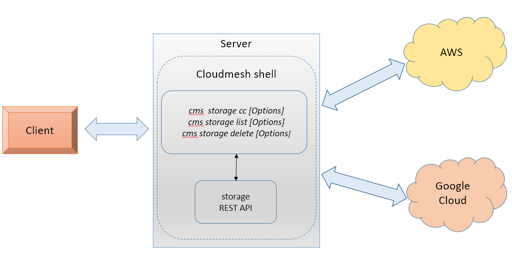

# Cloudmesh Storage Provider for Virtual Directories between  AWS and Google

Pratibha Pagadala |  [fa19-516-152](https://github.com/cloudmesh-community/fa19-516-152)

Project Code: 
[cloudmesh-storage](https://github.com/prati-mp/cloudmesh-storage) ,
[cloudmesh-google](https://github.com/prati-mp/cloudmesh-google)

## Introduction

This project is to develop API and rest services to manage and transfer
files between different cloud service providers. A cloudmesh based
command will be implemented to transfer files from a source to target
cloud provider. In this instance, the functionality will be implemented
for AWS and Google Cloud. For performance evaluation py tests will be
created.

## Motivation

 Multiple cloud providers offer storage solutions to manage data in the
 form of files. The intention here is to build a command which can
 provide functionality to move them from a source to a target cloud
 provider's storage. In this method, users will be able to split or move
 the data across different cloud providers that provider cheaper
 solutions.

## Architecture Diagram



##### Description

* Client intiates a cms storage_switch command with options such as
 
  1. File and directories copy from source to target
  2. List the files
  3. delete the files
  
* Cloudmesh storage copy command will run on the local server.
  According to the options and arguments, this would delegate the
  functions between AWS and Google Cloud.

* Storage and Utility APIs on AWS and Google cloud.   

## Technology Used

* Python
* REST
* AWS S3 Storage
* Google Cloud Storage
* OpenAPI
* cloudmesh

## Implementation

Storage copy function will allow to copy files between AWS S3 and Google storage buckets. 

**Pre-Requistes**
* Create a AWS Cloud Account, project and bucket 
* Create a Google Storage cloud account and bucket.

Account creation instructions are available in cloudmesh-manual:

[AWS Account Setup](https://cloudmesh.github.io/cloudmesh-manual/accounts/aws.html) | 
[Google Account Setup](https://cloudmesh.github.io/cloudmesh-manual/accounts/google/account.html)

**Installation:**
* Install Python 3.8 version
* Install cloudmesh-installer and following cloudmesh bundles - cloud, storage, google.
Refer to cloudmesh manual for installation steps: [cloudmesh installer installation](https://cloudmesh.github.io/cloudmesh-manual/installation/install-dev.html)

* Update account information in cloudmesh.yaml as instruction. Refer to cloudmesh manual for information: [yaml configuration steps](https://cloudmesh.github.io/cloudmesh-manual/configuration/configuration.html?highlight=cloudmesh%20yaml)

**Usage:**

````
Usage:

    storage copy --source=SOURCE:SOURCE_FILE_DIR --target=TARGET:TARGET_FILE_DIR
    storage list [SOURCE:SOURCE_FILE_DIR] 
    storage delete SOURCE:SOURCE_FILE_DIR 
    
Arguments:
 SOURCE:SOURCE_FILE_DIR   source provider name : file or 
                          directory name
 TARGET:SOURCE_FILE_DIR   destination provider name

Options:
 --source=SOURCE:SOURCE_FILE_DIR     specify the cloud:location
 --target=TARGET:LOCATION            specify the target:location

Description:

Command enables to Copy files between different cloud service providers,
list and delete them. This command accepts "aws" , "google" 
as the SOURCE and TARGET provider

cms storage_service copy --source=SOURCE:SOURCE_FILE_DIR 
                         --target=TARGET:TARGET_FILE_DIR
 
 Command copies files or directories from Source provider to Target
 Provider.

cms storage_service list SOURCE:SOURCE_FILE_DIR

 Command lists all the files present in SOURCE provider's in the given
 SOURCE_FILE_DIR location This command accepts "aws" or "google" as the
 SOURCE provider

cms storage_service delete SOURCE:SOURCE_FILE_DIR

 Command deletes the file or directory from the SOURCE provider's
 SOURCE_FILE_DIR location

Example:

cms storage_service copy --source=google:test1.txt 
                         --target=aws:uploadtest1.txt
cms storage_service list google:test
cms storage_service delete aws:uploadtest1.txt

````
## Dependencies / Constraints

* Copy currently downloads the source files from Source cloud to local file system and then uploads them to target cloud.
* Local Temp directory must be created in the path ~.cloudmesh/storage/tmp

## Testing

PyTest have been executed to test the functionality -
 
 [Test Script](https://github.com/prati-mp/cloudmesh-storage/blob/master/tests/copy/Test_storage_service.py) | [Test Results](https://github.com/prati-mp/cloudmesh-storage/blob/master/tests/copy/testResults.txt)

```
pytest -v --capture=no -W ignore::DeprecationWarning 
        tests/copy/Test_storage_service.py >  tests/copy/testResults.txt
```
## Benchmarks

Benchmarks results - [storage copy benchmarks](https://github.com/prati-mp/cloudmesh-storage/blob/master/tests/copy/testResults.txt)

```
+-------------------------------------------+----------+--------+---------------------+-------+-----------+----------+---------+---------------------------------+
| Name                                      | Status   |   Time | Start               | tag   | Node      | User     | OS      | Version                         |
|-------------------------------------------+----------+--------+---------------------+-------+-----------+----------+---------+---------------------------------|
| Test_storage_service/test_awstogoogle     | ok       | 19.109 | 2020-04-30 17:43:28 | copy  | PratiSree | Pratibha | Windows | ('10', '10.0.18362', 'SP0', '') |
| Test_storage_service/test_googletoaws     | ok       | 13.236 | 2020-04-30 17:43:47 | copy  | PratiSree | Pratibha | Windows | ('10', '10.0.18362', 'SP0', '') |
| Test_storage_service/test_googletoawsDir  | ok       | 14.817 | 2020-04-30 17:44:00 | copy  | PratiSree | Pratibha | Windows | ('10', '10.0.18362', 'SP0', '') |
| Test_storage_service/test_googletoawsDir2 | ok       | 12.694 | 2020-04-30 17:44:15 | copy  | PratiSree | Pratibha | Windows | ('10', '10.0.18362', 'SP0', '') |
+-------------------------------------------+----------+--------+---------------------+-------+-----------+----------+---------+---------------------------------+
```

## References

* <https://github.com/googleapis/google-cloud-python#google-cloud-python-client>
* <https://aws.amazon.com/s3/>
* <https://boto3.amazonaws.com/v1/documentation/api/latest/guide/resources.html>
* <https://github.com/cloudmesh/cloudmesh-storage/tree/master/cloudmesh/storage>
